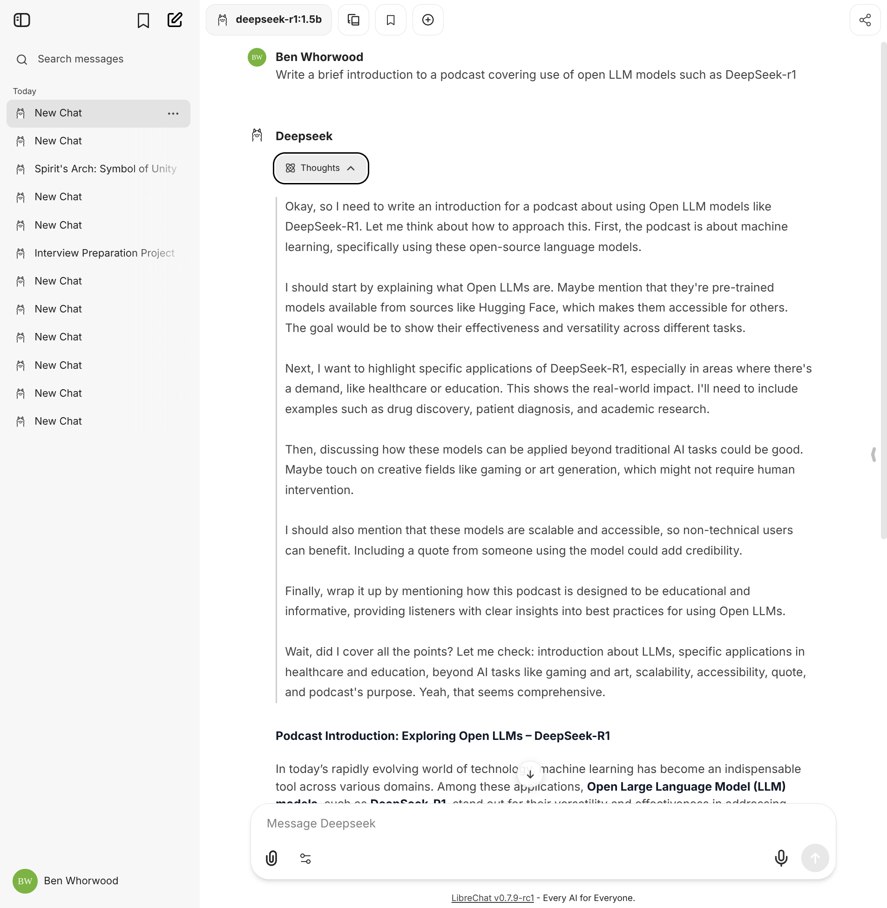

# Canopy AI Insights part 6 - LibreChat

## LibreChat demo branch with config files

For convenience we have forked the official LibreChat repository and have committed the config files for this episode:

[https://github.com/flowmoco/LibreChat/tree/demo/canopy-ai-insights](https://github.com/flowmoco/LibreChat/tree/demo/canopy-ai-insights)

Clone the above repository and checkout the `demo/canopy-ai-insights` (or download a zip) and then start LibreChat using `docker compose` (instructions below).

## LibreChat quick start files

The following files were used in this episode to run LibreChat and were created based on the LibreChat quick start guide (more details below).

Download these files to get up and running with a matching setup as this episode.

 - [.env](.env)
 - [docker-compose.override.yml](docker-compose.override.yml)
 - [librechat.yaml](librechat.yaml)
 
Note that the Ollama models have been intentionally restricted in `librechat.yaml`:

``` yaml
      models:
        default: [
          "deepseek-r1:1.5b",
          "granite3.3:2b",
          "llama3.2:latest"
          ]
        fetch: false # fetching list of models is not supported
```

To change LibreChat to fetch all models for your Ollama installation change `fetch` to `true`.

## LibreChat quick start links (includes Docker installation)

The following parts of the LibreChat quick start were used as the basis for the above files and this episode:

[Local Setup Guide](https://www.librechat.ai/docs/quick_start/local_setup)

[Custom Endpoints](https://www.librechat.ai/docs/quick_start/custom_endpoints)


## Start Ollama listening on all interfaces

``` shell
OLLAMA_HOST=0.0.0.0 ollama serve
```

## Start LibreChat using docker compose

``` shell
docker compose up
```

## Open LibreChat web interface

[http://localhost:3080/](http://localhost:3080/)

Create a user and then login to start using LibreChat.


